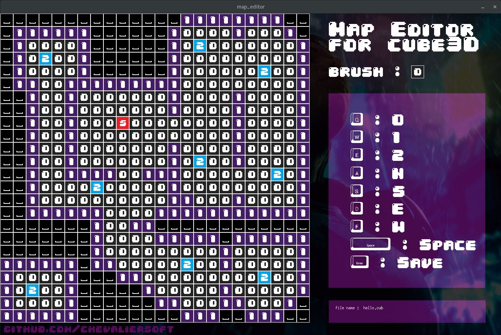

# cube3d_map_editor
Graphical map editor for cube3d allowing you to paint and save .cub files.
This editor is made with minilibx, so if you need to learn it, you can start by reading the code.
It's a tool made for 42's project cube3D.

It works on both OSX and Linux (tested on debian/kali).

## pro tips
- you can change brush by clicking on the brush icon
- you can't write in a file that already exist since we are not allowed to use remove() function.

## requirement
If you whant to use this editor on linux you need to install some libs and gcc :

``sudo apt-get install gcc make xorg libxext-dev libbsd-dev``

## installation
After your ``git clone`` just use ``make``
Then you will be able to ``./map_editor [size]``

## usage
``./map_editor [size]`` or ``./map_editor [sizeX] [sizeY]``

[size] must be between [0 - 24]

## what next
It is still a bit rigid (it has been made to be usable quickly). Ping me here or at school if you find a bug.

## links
You can find minilibx here (linux) : https://github.com/42Paris/minilibx-linux
